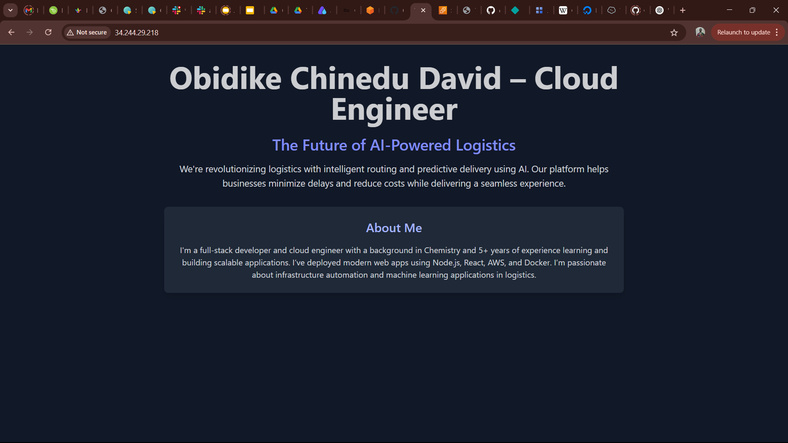

# AI-Logistics-Deployment
Deployment of AI Logistics Node.js app on AWS EC2 with Nginx


# AI Logistics Deployment Project

This project involved deploying a Node.js application (`ai-logistics`) on an Ubuntu server using PM2 for process management and Nginx as a reverse proxy. Below is a breakdown of all steps taken to complete the project.

---

## Table of Contents

1. [Server Setup]
2. [Application Setup]
3. [Web Server Configuration (Nginx)]
4. [Process Management with PM2]
5. [Testing Deployment]
6. [Pushing Project to GitHub]
7. [Live Server URL]
8. [Screenshot]

---

## 1. Server Setup

Provisioned an Ubuntu EC2 instance on AWS and connected via SSH:
```bash
ssh -i "your-key.pem" ubuntu@34.244.29.218


Updated and upgraded the system:
```bash
sudo apt update && sudo apt upgrade -y


Installed Node.js and npm:
```bash
sudo apt install nodejs npm -y


Installed PM2 globally:
```bash
sudo npm install pm2@latest -g


## 2. Application Setup

Uploaded or created the ai-logistics app in /var/www/ai-logistics.

Installed dependencies:
```bash
cd /var/www/ai-logistics
npm install


Started the app using PM2:
```bash
pm2 start server.js


Saved PM2 process list and enabled it on boot:
```bash
pm2 save
pm2 startup


## 3. Web Server Configuration (Nginx)

Installed Nginx:
```bash
sudo apt install nginx -y


Created a configuration file:
```bash
sudo nano /etc/nginx/sites-available/ai-logistics

Paste the following:
server {
    listen 80;
    server_name 34.244.29.218;

    location / {
        proxy_pass http://localhost:3000;
        proxy_http_version 1.1;
        proxy_set_header Upgrade $http_upgrade;
        proxy_set_header Connection 'upgrade';
        proxy_set_header Host $host;
        proxy_cache_bypass $http_upgrade;
    }
}


Enabled the config and restarted Nginx:
```bash
sudo ln -s /etc/nginx/sites-available/ai-logistics /etc/nginx/sites-enabled/
sudo nginx -t
sudo systemctl restart nginx


## 4. Process Management with PM2

Checked running PM2 processes:
```bash
pm2 list


Ensured the app is always running using:
```bash
pm2 save
pm2 startup


## 5. Testing Deployment

Visited the app using the public IP in a browser:

In the browser, input: http://34.244.29.218

Confirmed that the page loaded successfully.


## 6. Pushing Project to GitHub

After setup, I initialized a local Git repo and pushed it to GitHub:
```bash
cd /var/www/ai-logistics
git init
git remote add origin https://github.com/your-username/your-repo.git
git add .
git commit -m "Initial deployment commit"
git push -u origin main


## 7. Live Server URL
Public IP Address: http://34.244.29.218


## 8. Screenshot

Below is a screenshot of the rendered app in the browser:




## Notes:
1. PM2 ensures the Node.js server is kept alive and restarted on reboot.
2. Nginx acts as a reverse proxy between incoming traffic and the Node.js app.
3. No domain/SSL was used for this submission due to unavailability of a free domain.
